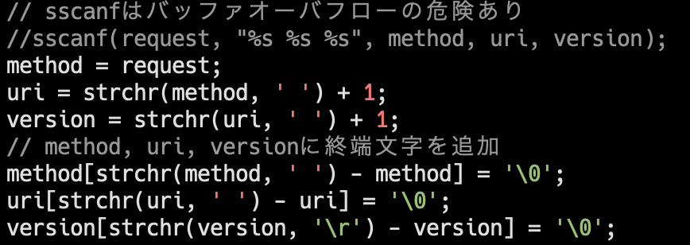

# my HTTP/1.1
練習のための簡単なHTTPサーバ

# 実装済みの機能
- GETリクエストに対する応答
  - html,画像 (png, jpeg) に対応
- それ以外のリクエストには501を返す

# 使い方
1. コンパイル  
```gcc serv.c -o serv```  
```gcc serv.c -o serv -DDEBUG``` とすると受け取ったリクエストが標準エラー出力に出力されるようになる  

1. サーバの実行  
```./serv```  
localhostの12345番ポートでリクエストを待ち受ける
	- 終了は`ctrl+c`

1. ブラウザからローカルのhtmlファイルにアクセスする  
例: `http://localhost:12345/index.html`  
(サーバと同じフォルダにindex.htmlがある場合)

# Buffer Overflow脆弱性の修正
6/30時点で開発中のコードには，リクエストラインのHTTP method, 目的のURI, HTTP versionを解釈する部分にバッファオーバーフローを起こす脆弱性があった．
以下にその例を示すとともに，対処についてメモする．

**修正内容が書いてあるcommitは[こちら](https://github.com/kanon22/my-http/commit/a777c7c76e4ff10ca46cbcffb6aabf063a85d126)**

## 脆弱性の概要
当初のコードはリクエストヘッダからHTTP method, 目的のURI, HTTP versionを取得し，以下の変数に文字列として代入していた．
```
char method[16];
char uri[256];
char version[64];
```

しかし，`sscanf`関数を用いていたため，代入元のリクエストの長さによっては，バッファオーバーフローを起こす場合があった．
次の画像はcurlによる，目的のURIの長さが256を超える (A*256 + /index.html) リクエストの例である．  
curlによるGETリクエストのため，サーバは501以外をレスポンスすることが予想されるが，実際は`501 Not Implemented`が返ってしまっている．


そのリクエストに対するサーバのlogを見ると，uriがオーバーフローした結果，methodに`GET`ではなく`A/index.html`が代入されていて，
それによってGETリクエストではないとサーバが判断することで間違ったレスポンスをしていることがわかる．


## 脆弱性への対処
バッファオーバーフローの対処はいくつかやり方があると思うが，今回は`method, uri, version`の3つの変数をchar型のポインタに変更し，
リクエストが格納された文字列の途中の場所を指すことにした．  
リクエストラインは半角スペースで区切られているため，それを`'\0'`に変換することで3つの変数を独立した文字列として扱えるようにした．



その結果，前述の長いURIを含むリクエストを送信しても，以下の画像にある通り正しく`404 Not Found`をレスポンスするようになった．


# 参考
RFC2616 (https://tools.ietf.org/html/rfc2616) など
